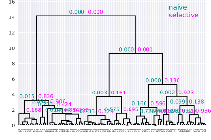
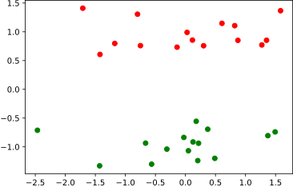
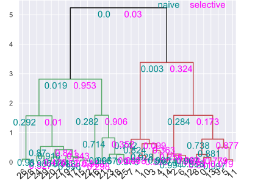
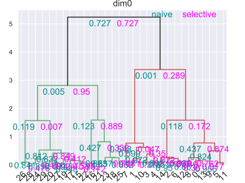
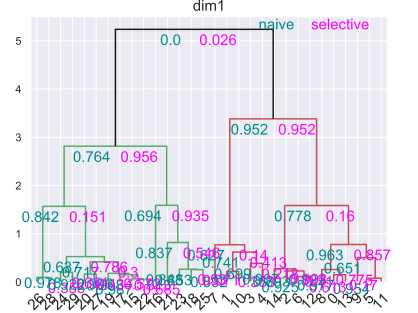

# Post Hierarchical Clustering Inference
<div align="center">



</div>

## Abstract
It is an important task to analyze data having multiple clusters behind such as gene expression level data and customer’s purchase history data and discover trends peculiar to each cluster. However, the clustering results are based on subjectivity such as technical knowledge of data, and are not objective. Therefore, we consider using a statistical hypothesis testing to evaluate the reliability of clustering. However, when performing two step inference, such as inference after clustering, the influence of clustering must be considered and corrected appropriately. In this study, we first apply Ward method, which is one of hierarchical clustering, to data with multiple average structures for each cluster to obtain the cluster hierarchical structure. After that, we perform two valid hypothesis testing methods in each branch by exploiting the framework of Selective Inference. 
## Environmental Requirement
- gcc 8.2.0
- GNU Make 3.81
- Install eigen and openmp if compiling c++ source
- Python version 3.7.0
- Please install required packages when the python "ImportError" occurs
  

## Usage
### Hypothesis testing for differences between cluster centers
Under the `cluster` directory.
#### <u> Compile (When necessary) </u>
    
    $ cd /cluster/cpp_source
    $ make

***Warning: Change the path of `eigen` as needed.***

#### <u> Preprocessing (When applied to real data) </u>
`preprocess.py`
- Split the data for variance estimation and p-value calculation (variance estimation: p-value calculation = 2 : 8).
- Data for p-value calculation is normalized each variables.

1. Execute `preprocess.py` for the data you want to preprocess.
2. `data`,`stat`, and `interval` directorys are created, and the following files are created in the `data` directory.
    - `data.csv` : For p-value calculation
    - `d_ind.csv` : Index which data to use for p-value calculations 
    - `estimate.csv` : For estimation variances
    - `sigma.csv`, `xi.csv` :  

Example <br>

    $ python preprocess.py data.csv

#### <u> Clustering and Hypothesis Testing </u>

**Calculate p-value for one step** <br>

run `calc_p.py` <br> 

Arguments
- path of `data.csv`
- path of `sigma.csv`
- path of `xi.csv`
- step ()
- Whether to compute in parallel (2 or more: parallel)

Example (parallel computation using 3 cores in the first step) 

    $ pyton calc_p.py data/data.csv data/sigma.csv data/xi.csv 0 3

**Calculate p-value for all steps** <br>

run `calc_p_all.py` <br>

Arguments
- path of `data.csv`
- path of `sigma.csv`
- path of `xi.csv`
- Whether to compute in parallel (2 or more: parallel)


Example (not parallel computation) 
 <br>

    $ pyton calc_p_all.py data/data.csv data/sigma.csv data/xi.csv 1


***Warning: The file extension of the execute file used in `calc_p_all.py`, `calc_p.py` is `exe`, so please change it appropriately.***

Both `calc_p.py` and `calc_p_all.py`, the p-value calculation result is output under the `result` directory
- `naive_p.csv`
- `selective_p.csv`

Other outputs
- `stat` directory : output  a csv file that describes the statistic and the number of dimensions of data at each step
- `interval` directory : output the interval required when calculating the selective-p value
- `cluster_result` directory : output the following csv file.
  - output.csv (It has the same format as `Z` of scikit-learn [linkage](https://docs.scipy.org/doc/scipy/reference/generated/scipy.cluster.hierarchy.linkage.html#scipy.cluster.hierarchy.linkage))

#### <u> Demo </u>
Simple demo data is placed directly under `cluster/data/`

<div align="center">



</div>

Example <br>

    $ python calc_p_all.py data/demo_data.csv data/demo_sigma.csv data/demo_xi.csv 1

Display dendrogram with p-value. <br>

    $ python display_dendro_p_cluster.py

<div align="center">



</div>


#### <u> Demo (synthetic) </u>
synthetic experiments program in the `demo_synthetic` directory <br>
Please run `calc_synthetic.py`


Arguments
- Number of epoch (default:1000)
- Sample size  
- Dimension  
- step ()
- Whether to compute in parallel (2 or more: parallel)
- Mean  : Generate two clusters by changing the mean of half () of the data

***Setting mean that is the sixth argument to 0.0 is an experiment of FPR  , and to a value greater than 0.0 is an experiment for TPR.***

**FPR** <br>
Setting mean to 0.0 is an FPR experiment, and n becomes the maximum size (). <br>

Example1 (Experiment of FPR, , first step, calculation of $1000$ times no parallel)
    
    $ python calc_synthetic.py 1000 50 5 0 1 0.0

**TPR** <br> 
Setting mean to a value greater than 0.0 is an TPR experiment, and  becomes the maximum size (0.5, 1.0, 1.5, ..., ). <br>
<u> In the TPR experiment, any value entered in the argument of step will be automatically changed to the last step. </u> <br>

Example2 (Experiment of TPR, , last step, calculation of 100 times, parallel computation using 3 cores,  <br>

    $ python calc_synthetic.py 1000 30 10 28 100 4 2.0


### Hypothesis testing for differences between each dimension of cluster centers
Under the `each_dim` directory

#### <u> Preprocessing (When applied to real data) </u>

`preprocess.py`

Same as `preprocess.py` in Hypothesis testing for differences between cluster centers

#### <u> Clustering and Hypothesis Testing </u>
**Calculate p-value for one step** <br>

run `execute.py` <br>

Arguments
- path of `data.csv`
- path of `Sigma.csv`
- path of `Xi.csv`
- step ()
- Whether to compute in parallel (2 or more: parallel)
  
Example

    $ pyton execute.py data/data.csv data/Sigma.csv data/Xi.csv 0 1

#### Calculate p-value for all steps
run `execute_allstep.py`

Arguments
- path of `data.csv`
- path of `Sigma.csv`
- path of `Xi.csv`
- step (0 ~ n - 2)
- Whether to compute in parallel (2 or more: parallel)

Example <br>

    $ pyton execute_allstep.py data/data.csv data/Sigma.csv data/Xi.csv 1

Both calc_p.py and calc_p_all.py, the p-value calculation result is output under the result directory.

Both `execute.py` and `execute_allstep.py`, the following csv file is output under the `result` directory.
- output.csv (It has the same format as `Z` of scikit-learn [linkage](https://docs.scipy.org/doc/scipy/reference/generated/scipy.cluster.hierarchy.linkage.html#scipy.cluster.hierarchy.linkage))
- naive_p.csv 
- selective_p.csv

#### <u> Demo </u>
Simple demo data is placed under `each_dim/data/`. <br>
Data not separated in the first dimension (horizontal axis) but separated in the second dimension (vertical axis).
<div align="center">


</div>

Example <br>

    $ python execute_allstep.py data/demo_data.csv data/demo_Sigma.csv data/demo_Xi.csv 1

Display dendrogram with p-values. <br>

    $ python display_dendro_p_dim.py 0
A dendrogram with the p-value given in the test in the first dimension is obtained. Since it doesn't separate in the first dimension, a large value is obtained.
<div align="center">



</div>

Test results in second dimension. At the top step of p-value is small  because data is actually separated in second dimension.

    $ python display_dendro_p_dim.py 1

<div align="center">



</div>


### Display dendrogram with p-value
Please import `pv_dendrogram`function in the 
`/cluster/display_dendro_p_cluster.py`or`/each_dim/display_dendro_p_cluster.py``pv_dendrogram` <br> <br>
#### pv_dendrogram(sp, nap, start, output, root=0, width=100, height=0, decimal_place=3, font_size=15, **kwargs) 
Arguments <br>
- sp: ndarray <br>
    The ndim of ndarray is one.
- nap: ndarray <br>
  The ndim of ndarray is one.
- start: int <br>
    From which hierarchy to display the p-value.
    If start = 0, display p-value of all steps.
- output: list, ndarray <br>
    `Z` of [scipy.cluster.step.linkage](https://docs.scipy.org/doc/scipy/reference/generated/scipy.cluster.step.linkage.html#scipy.cluster.step.linkage).      
- root: int <br>
    Takes the specified number of times square root in the distance of `Z`. Default is 0.
- width: double <br>
    Width between naive-p and selective-p values in each step. Default is 100.
- height: double <br>
    Height when displaying naive-p value and selective-p value of each step. The higher the size, the higher it is displayed.
    Default is 0.
- decimal_place: int <br>
    How many decimal places are displayed. Default is 3.
- font_size: int <br>
    Fontsize of naive-p, selective-p, and legend.
- **kwargs: <br>
    It is possible to specify 
    kwargs of [scipy.cluster.step.dendrogram](https://docs.scipy.org/doc/scipy/reference/generated/scipy.cluster.step.dendrogram.html#scipy.cluster.step.dendrogram).
        
Returns:  <br>
    Output of [scipy.cluster.step.dendrogram](https://docs.scipy.org/doc/scipy/reference/generated/scipy.cluster.step.dendrogram.html#scipy.cluster.step.dendrogram).
    

## Structure of directory

```
root/
    |- cluster/
          |- cluster_result/
          |- cpp_source/
          |- data/
          |- interval/
          |- stat/
          |- calc_p_all.py
          |- calc_p.py
          |- ...
    |- each_dim/
          |- cpp_source/
          |- data/
          |- result/...
          |- execute_allstep.py
          |- execute.py
          |- ...
    |- figs
    |- README.md
```
## Notes
- `data.csv`, `sigma.csv`, `xi.csv` should be a value-only format, otherwise an error will occur.

